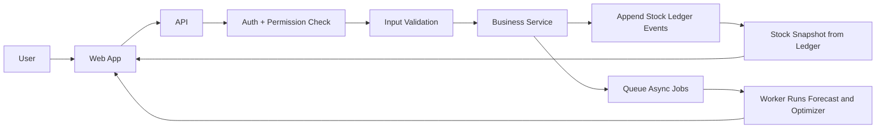
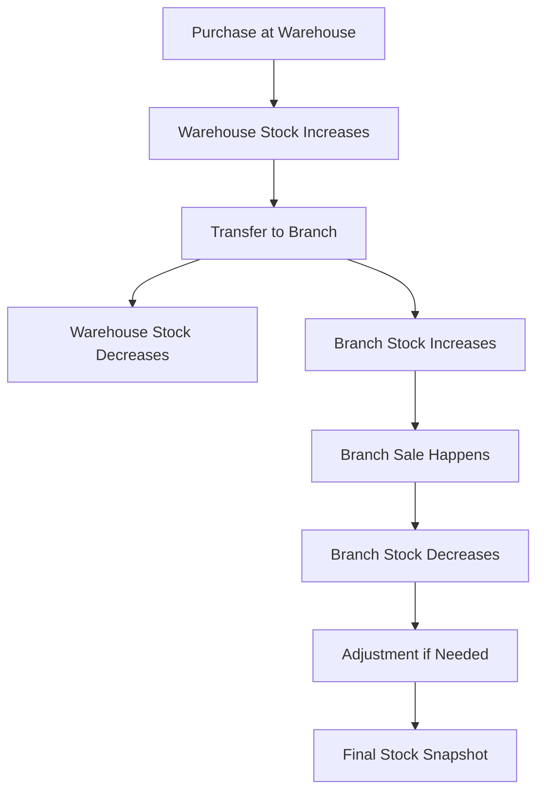
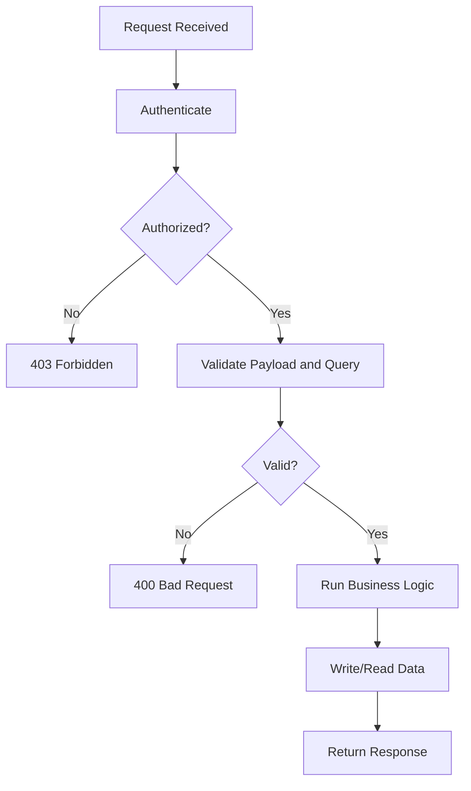

# Inventory Management System (IMS) Monorepo

Production-grade IMS starter using npm workspaces:

- Next.js (TypeScript) web app
- Fastify (TypeScript) API
- BullMQ worker
- Prisma + PostgreSQL
- Redis queues
- Shared packages for algorithms, RBAC, types, UI, config

## Getting Started

1. Start infra:

```bash
docker compose -f infra/docker-compose.yml up -d
```

2. Install dependencies:

```bash
npm install
```

3. Copy env files:

```bash
copy .env.example .env
copy apps\api\.env.example apps\api\.env
copy apps\worker\.env.example apps\worker\.env
```

4. Generate Prisma client + migrate:

```bash
npm run prisma:generate
npm run prisma:migrate
```

5. Start dev servers:

```bash
npm run dev
```

See docs:
- `docs/FOLDERS.md`
- `docs/DOMAIN.md`

## Platform Flow (Clear Guide)

This section explains the platform in simple terms so any team member can understand features and use them correctly.

### What this platform does

IMS manages stock across:

- One central warehouse
- Multiple branches

It supports day-to-day operations:

- Record purchase stock at warehouse
- Transfer stock from warehouse to branch
- Record sales at branch
- Record stock adjustments after physical checks
- View stock and stock history
- Run forecasting and optimizer suggestions for planning

### Who uses it

- Admin: full access across warehouse and branches
- Branch manager: operates assigned branches
- Sales user: sales and branch-scoped views only

## One-Minute Platform Flow



## How To Use The Platform (Step-by-Step)

### Step 1: Login and access control

1. Login from Web app.
2. API verifies token.
3. Role and permission rules decide which features are visible and allowed.

### Step 2: Add stock to warehouse (Purchase)

Use this when new inventory arrives from suppliers.

1. Open Purchase feature.
2. Provide `productId`, `warehouseId`, `quantity` and optional `referenceNo`, `notes`.
3. Submit.
4. System adds a positive warehouse ledger event.
5. Stock snapshot increases for that product in warehouse.

### Step 3: Move stock to branch (Transfer)

Use this for branch replenishment.

1. Open Transfer feature.
2. Provide `productId`, `warehouseId`, `branchId`, `quantity`.
3. Submit.
4. System creates two ledger events in one operation:
   - Warehouse stock decreases
   - Branch stock increases
5. Both locations are now reflected in stock snapshot.

### Step 4: Record sale at branch (Sale)

Use this when branch sells inventory.

1. Open Sale feature.
2. Provide `productId`, `branchId`, `quantity`.
3. Submit.
4. System adds a negative branch ledger event.
5. Branch stock decreases in snapshot.

### Step 5: Correct stock (Adjustment)

Use this after stock audit, damage, or correction.

1. Open Adjustment feature.
2. Provide `productId`, `quantityDelta` and only one location:
   - `warehouseId` or
   - `branchId`
3. Submit.
4. System adds adjustment ledger event with positive or negative delta.
5. Stock snapshot updates immediately.

### Step 6: Check current stock and history

Use this for operational monitoring.

1. Open Stock view for current quantities.
2. Open Ledger view for event history.
3. Apply filters like product, branch, warehouse, event type, page, and limit.
4. Review movement trail for audit and debugging.

### Step 7: Use planning intelligence (Forecast + Optimizer)

Use this for better replenishment decisions.

1. Enter budget and candidate products.
2. System scores products (ABC class and factors).
3. Knapsack optimizer suggests best mix under budget.
4. Forecast output supports expected demand planning.

## Feature-to-Outcome Map

| Feature | Input | System Action | Outcome |
| --- | --- | --- | --- |
| Purchase | Product, warehouse, quantity | Adds positive warehouse ledger event | Warehouse stock increases |
| Transfer | Product, warehouse, branch, quantity | Adds transfer-out and transfer-in ledger events | Warehouse decreases, branch increases |
| Sale | Product, branch, quantity | Adds negative branch ledger event | Branch stock decreases |
| Adjustment | Product, quantityDelta, one location | Adds adjustment ledger event | Corrected stock level |
| Stock View | Optional filters | Aggregates ledger by location/product | Current stock snapshot |
| Ledger View | Optional filters + pagination | Returns append-only movement records | Audit-ready history |
| Optimizer | Budget + product candidates | Runs scoring + knapsack | Best buying/replenishment plan |
| Forecast | Historical trend inputs | Runs SES demand prediction | Better demand planning |

## Inventory Movement Flowchart



## API Request Safety Flow



## Simple Rules To Remember

- Stock is not edited directly; events are added to the ledger.
- Current stock is calculated from all ledger events.
- Every inventory change is traceable with timestamp and reference.
- Transfer always impacts two locations.
- Permissions control what each role can perform and view.


You can use the following credentials to explore the system. All accounts use the same default password.

**Default Password**: `Admin@1234`

| Role | Branch | Email |
| --- | --- | --- |
| **Admin** | Global | `admin@ims.local` |
| **Staff** | North Branch | `staff.no@ims.local` |
| **Staff** | South Branch | `staff.so@ims.local` |
| **Staff** | East Branch | `staff.ea@ims.local` |
| **Staff** | West Branch | `staff.we@ims.local` |
| **Staff** | Central Hub | `staff.hb@ims.local` |